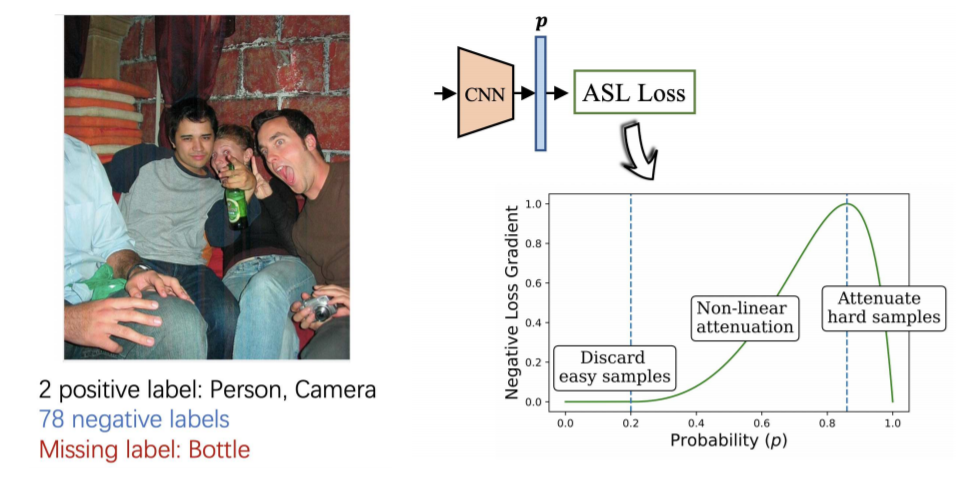
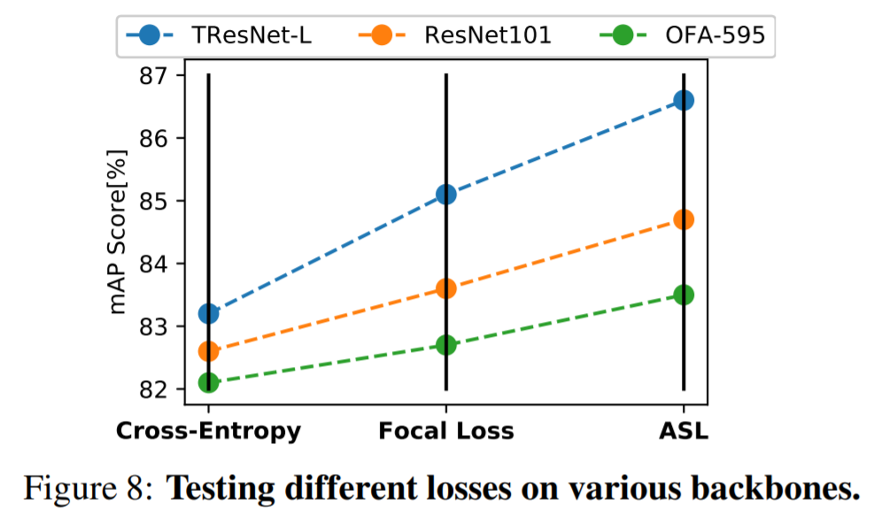
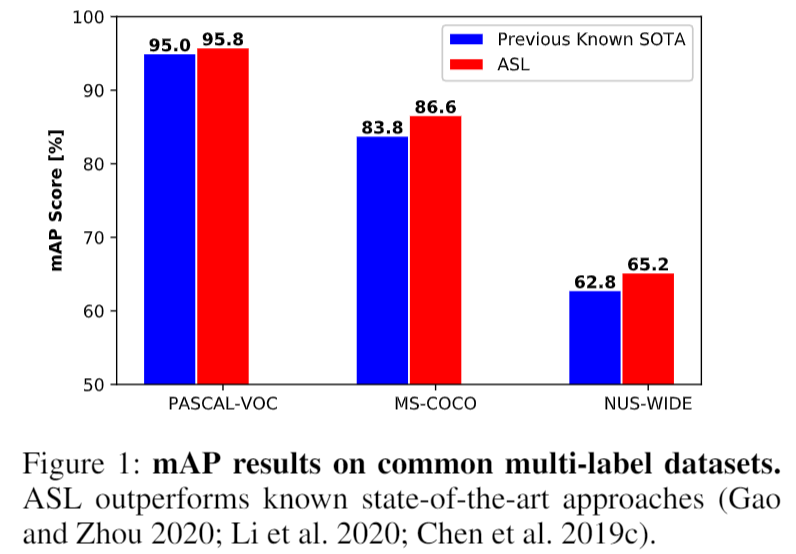
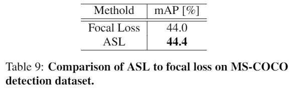
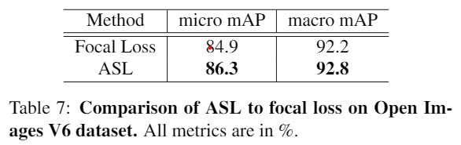
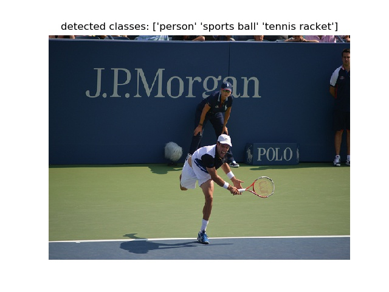
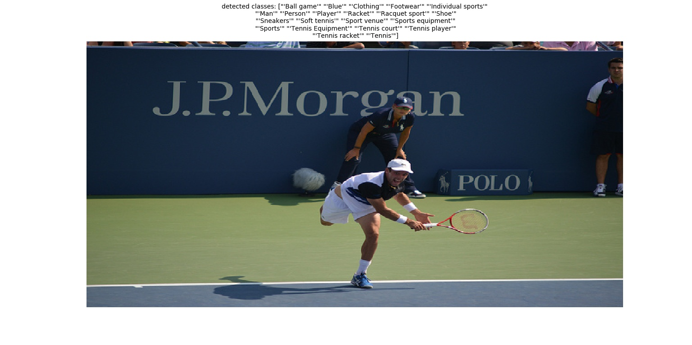

# Asymmetric Loss For Multi-Label Classification

[](https://paperswithcode.com/sota/multi-label-classification-on-ms-coco?p=imagenet-21k-pretraining-for-the-masses)<br>
[](https://paperswithcode.com/sota/multi-label-classification-on-nus-wide?p=asymmetric-loss-for-multi-label)<br>
[](https://paperswithcode.com/sota/multi-label-classification-on-pascal-voc-2007?p=imagenet-21k-pretraining-for-the-masses)<br>
<br> [Paper](https://arxiv.org/abs/2009.14119) |
[Pretrained models](MODEL_ZOO.md)

Official PyTorch Implementation

> Emanuel Ben-Baruch, Tal Ridnik, Nadav Zamir, Asaf Noy, Itamar
> Friedman, Matan Protter, Lihi Zelnik-Manor<br/> DAMO Academy, Alibaba
> Group

**Abstract**

In a typical multi-label setting, a picture contains on average few positive labels, and many negative ones. This positive-negative imbalance dominates the optimization process, and can lead to under-emphasizing gradients from positive labels during training, resulting in poor accuracy. In this paper, we introduce a novel asymmetric loss ("ASL"), which operates differently on positive and negative samples. The loss enables to dynamically down-weights and hard-thresholds easy negative samples, while also discarding possibly mislabeled samples. We demonstrate how ASL can balance the probabilities of different samples, and how this balancing is translated to better mAP scores. With ASL, we reach state-of-the-art results on multiple popular multi-label datasets: MS-COCO, Pascal-VOC, NUS-WIDE and Open Images. We also demonstrate ASL applicability for other tasks, such as single-label classification and object detection. ASL is effective, easy to implement, and does not increase the training time or complexity.

<p align="center">
 <table class="tg">
  <tr>
    <td class="tg-c3ow"></td>
    <td class="tg-c3ow"></td>
  </tr>
</table>
</p>

<!--<p align="center">-->
<!-- <table class="tg">-->
<!--  <tr>-->
<!--    <td class="tg-c3ow"></td>-->
<!--    <td class="tg-c3ow"></td>-->
<!--  </tr>-->
<!--</table>-->
<!--</p>-->

<!--<p align="center">-->
<!-- <table class="tg">-->
<!--  <tr>-->
<!--    <td class="tg-c3ow"></td>-->
<!--    <td class="tg-c3ow"></td>-->
<!--  </tr>-->
<!--</table>-->
</p>

## 24/10/2021 Update - New article released, extending ASL to partial labeling scenerio
Checkout our new project, [Multi-label Classification with Partial Annotations using Class-aware Selective Loss](https://github.com/Alibaba-MIIL/PartialLabelingCSL), where we presnet a top solution
to multi-label datasets which are using partial annotation (such as Open Images and LVIS).

## 24/7/2021 Update - ASL article was accepeted to ICCV 2021
A final version of the paper, with updated results for ImageNet-21K pretraining, is released to arxiv.  
Note that ASL is becoming the de-facto 'default' loss for high performance multi-label classification, and all the top results in papers-with-code are currently using it.

<!--## 23/4/2021 Update - ImageNet21K Pretraining-->
<!--In a new [article](https://github.com/Alibaba-MIIL/ImageNet21K) we released, we share pretrain weights for different models, that dramatically outperfrom standard pretraining on downstream tasks, including multi-label ones.  -->
<!--We also compare in the article multi-label pretrianing with ASL on ImageNet21K to pretraining with standard loss functions (cross-entropy and focal loss).-->

## Training Code Now Available !

With great collaboration by [@GhostWnd](https://github.com/GhostWnd), we
now provide a [script](train.py) for fully reproducing the article
results, and finally a <u>modern</u> multi-label training code is
available for the community.
## Frequently Asked Questions
Some questions are repeatedly asked in the issues section. make sure to
review them before starting a new issue:
- Regarding combining ASL with other techniques, see
  [link](https://github.com/Alibaba-MIIL/ASL/issues/35)
- Regarding implementation of asymmetric clipping, see [link](https://github.com/Alibaba-MIIL/ASL/issues/10)
- Regarding disable_torch_grad_focal_loss option, see
  [link](https://github.com/Alibaba-MIIL/ASL/issues/31)
- Regarding squish Vs crop resizing, see
  [link](https://github.com/Alibaba-MIIL/ASL/issues/30#issuecomment-754005570)
- Regarding training tricks, see
  [link](https://github.com/Alibaba-MIIL/ASL/issues/30#issuecomment-750780576)
- How to apply ASL to your own dataset, see
  [link](https://github.com/Alibaba-MIIL/ASL/issues/22#issuecomment-736721770)


## Asymmetric Loss (ASL) Implementation
In this PyTorch [file](\src\loss_functions\losses.py), we provide 
implementations of our new loss function, ASL, that can serve as a
drop-in replacement for standard loss functions (Cross-Entropy and
Focal-Loss)

For the multi-label case (sigmoids), the two implementations are: 
- ```class AsymmetricLoss(nn.Module)```
- ```class AsymmetricLossOptimized(nn.Module)``` <br>

The two losses are bit-accurate. However, AsymmetricLossOptimized()
contains a more optimized (and complicated) way of implementing ASL,
which minimizes memory allocations, gpu uploading, and favors inplace
operations.

For the single-label case (softmax), the implementations is called:
- ```class ASLSingleLabel(nn.Module)```


## Pretrained Models
In this [link](MODEL_ZOO.md), we provide pre-trained models on various
dataset. 

## Validation Code
Thanks to external contribution of @hellbell, we now provide a
validation code that repdroduces the article results on MS-COCO:

```
python validate.py  \
--model_name=tresnet_l \
--model_path=./models_local/MS_COCO_TRresNet_L_448_86.6.pth
```

## Inference Code
We provide [inference code](infer.py), that demonstrate how to load our
model, pre-process an image and do actuall inference. Example run of
MS-COCO model (after downloading the relevant model):
```
python infer.py  \
--dataset_type=MS-COCO \
--model_name=tresnet_l \
--model_path=./models_local/MS_COCO_TRresNet_L_448_86.6.pth \
--pic_path=./pics/000000000885.jpg \
--input_size=448
```
which will result in:
<p align="center">
 <table class="tg">
  <tr>
    <td class="tg-c3ow"></td>
  </tr>
</table>
</p>

Example run of OpenImages model:
```
python infer.py  \
--dataset_type=OpenImages \
--model_name=tresnet_l \
--model_path=./models_local/Open_ImagesV6_TRresNet_L_448.pth \
--pic_path=./pics/000000000885.jpg \
--input_size=448
```
<p align="center">
 <table class="tg">
  <tr>
    <td class="tg-c3ow"></td>
  </tr>
</table>
</p>


## Citation
```
 @misc{benbaruch2020asymmetric, 
        title={Asymmetric Loss For Multi-Label Classification}, 
        author={Emanuel Ben-Baruch and Tal Ridnik and Nadav Zamir and Asaf Noy and Itamar Friedman and Matan Protter and Lihi Zelnik-Manor}, 
        year={2020}, 
        eprint={2009.14119},
        archivePrefix={arXiv}, 
        primaryClass={cs.CV} }
```

## Contact
Feel free to contact if there are any questions or issues - Emanuel
Ben-Baruch (emanuel.benbaruch@alibaba-inc.com) or Tal Ridnik (tal.ridnik@alibaba-inc.com).
